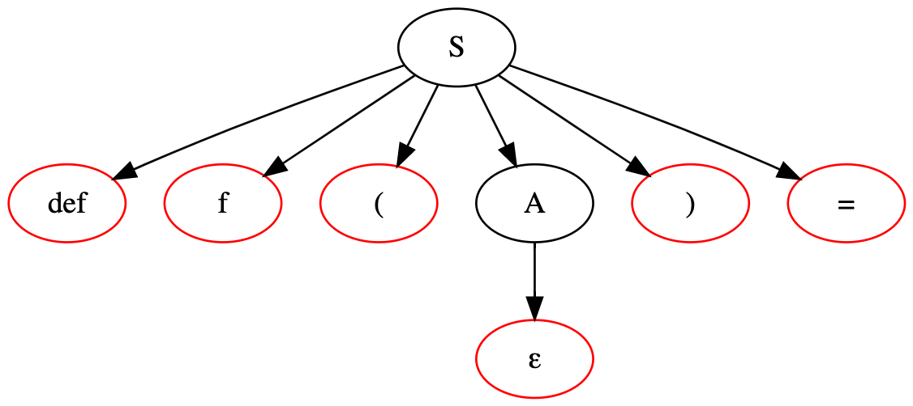

# Recursive descent parser

## Task description
1. Define a context-free grammar for the language of *Python function headers*.
2. Implement a lexical analyzer (input — strings, output — sequence of terminals (tokens)). Spaces and line feeds should be ignored. 
3. Construct the FIRST and FOLLOW sets for the nonterminals of your grammar. Implement recursive descent parser. 
4. Prepare a visualization of the parsing trees.
5. Write tests.

## Solution description
### 1. Grammar definition
Let's define the grammar:
```
S -> D V ( A ) E
A -> ε
A -> V A'
A' -> ε
A' -> , V A'
```
where:
```
D  <-> 'def'
V  <-> Function or variable name
A  <-> Comma-separated arguments (without braces)
A' <-> Continuation of A (without the first argument)
E  <-> '='
```

### 2. Lexical analyzer implementation
[`LexicalAnalyzer.hs`](src/LexicalAnalyzer.hs)

### 3. Parser implementation
```
First(S) = {D}
Follow(S) = {$}
First(A) = {ε, V} 
Follow(A) = {')'}
First(A') = {ε, ','}
Follow(A') = {ε, ')'}
```
[`Parser.hs`](src/Parser.hs)

### 4. Parsing tree visualization
##### `def functionName(a,b,c)=`

---------------------------------------------------------------------------
##### `def f()=`

---------------------------------------------------------------------------
##### `def g(x)=`

---------------------------------------------------------------------------

### 5. Tests
[`Spec.hs`](test/Spec.hs)